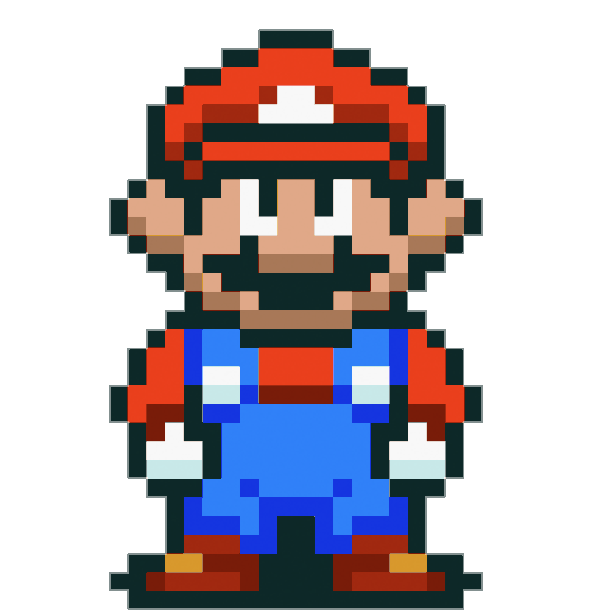
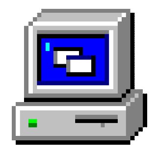
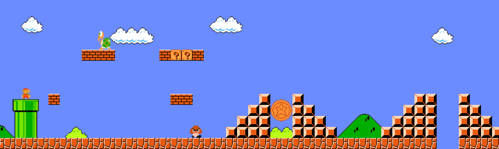

# TheSaltwaterRoom 

###  Hello world! 

  <em>
    今生是我们的哨岗，即便今天艰难，也愿精彩度日。接受每一个给定的剧本，从容走向下一场命定。
  </em>

<b>-- 罗翔老师</b>

 

## About

- Developer who enjoys backend engineering, practical tooling, and clean system design.
- Currently keeping this profile lightweight and stable by avoiding third-party image cards that may fail to load.
- Most profile visuals are served from this repository's local `Assets` folder.

## Featured Repositories

| Project | Description |
| --- | --- |
| [laravelApi](https://github.com/TheSaltwaterRoom/laravelApi) | Laravel API project |
| [DesignPatternsPHP](https://github.com/TheSaltwaterRoom/DesignPatternsPHP) | PHP design pattern examples |

## Connect With Me 

| LinkedIn | Twitter | Instagram | GitHub |
| :---: | :---: | :---: | :---: |
|  |  |  | [TheSaltwaterRoom](https://github.com/TheSaltwaterRoom) |

 

<!--
Notes:
- Removed github-readme-stats image cards because third-party rendering can be blocked or temporarily unavailable.
- Kept profile images local to this repository to reduce broken images on the GitHub profile page.
-->
